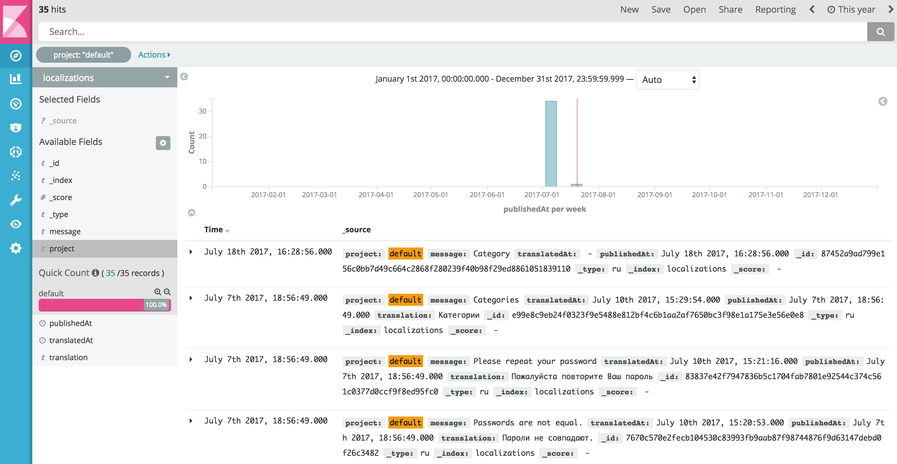

# i18n-central-storage

helps to agragate translations from several projects to one place(in our case elasticsearch only supported),

# 

You can have your own i18-n or i18n-2 with followen configuration for example:

```js
var locales = ['ru', 'en'];
var i18nConfig = {
    locales: locales,
    defaultLocale: 'ru',
    directory: './messages/'
};
var i18n = new (require('i18n-2'))(i18nConfig);
```

and you have your source files with messages that should be translated, so you can specify patterns for singular and plural:

```js
// match any string in your code with gettext('any text')
var pattern = /gettext\('(.*?)'\)/gi;
// match any string in your code with gettextP('singular', 'plural', count)
var pluralPattern = /gettextP\('(.*?)', *'(.*?)', *(\d+)\)/gi;
```

and directories where your source code located:

```js
var directories = [
    path.resolve(__dirname, '../templates/'),
    path.resolve(__dirname, '../assets/js')
];
```

and extentions(array of strings) that should be included in search:

``` js
var extentions = ['.js', '.ejs', '.jsx'];
```

list of other configuration options:
```js
// setting extension of messages files - defaults to '.js'
extension: '.js',

// where to store files - required parameter
messagesDirectory: './mylocales',

// here you should specify host and port of your elasticsearch instance,
// index wich you are going to use and project reference to split several projects by
// that property
var elasticConfig = {
    host: '192.168.1.237:9200',
    index: 'localizations',
    project: 'projectReferenceOne'
};
```

as result all you translated messages will be fetched from elasticsearch and placed to your localization file.


usage example as a gulp task for one locale:

```js

var I18nCentralStorage = require('i18n-central-storage');
var path = require('path');

var directories = [
    path.resolve(__dirname, '../templates/'),
    path.resolve(__dirname, '../assets/js')
];
var messagesDirectory = path.resolve(__dirname, '../messages/');
var extentions = ['.js', '.ejs', '.jsx'];
var pattern = /gettext\('(.*?)'\)/gi;

var elasticConfig = {
    host: '192.168.1.237:9200',
    index: 'localizations',
    project: 'projectReferenceOne'
};

var taskFunction = function() {

        var promise = new Promise(function(resolve, reject){
            var i18nCentralStorage = new I18nCentralStorage.default({
                directories,
                messagesDirectory,
                extentions,
                pattern,
                elasticConfig
            }, function() {

                var locale = 'ru';
                var result = i18nCentralStorage.analize(locale);

                i18nCentralStorage
                    .syncLocale(result, locale, { writeResultToFile: true })
                    .then(function (result) {

                        resolve(result);
                    })
                    .catch(function (error) {
                        reject(error);
                    });
            });
        });

        return promise;
    };


module.exports = taskFunction;

```

# migration to version 2.*
since we should use only one _type for future versions of elastic (from 7.*) we should gave only documents with single type, see:
https://www.elastic.co/blog/index-type-parent-child-join-now-future-in-elasticsearch

execute in kibana following:
```$xslt
POST _reindex
{
  "source": {
    "index": "localizations"
  },
  "dest": {
    "index": "localizations.v2"
  },
  "script": {
    "source": """
    ctx._id = ctx._type + "-" + ctx._id;
    ctx._source.locale = ctx._type;
    ctx._type = "doc";
"""
  }
}

POST localizations.v2/doc/_delete_by_query
{
  "query": {
    "match": {
      "locale": {
        "query": "messages"
      }
    }
  }
}
```